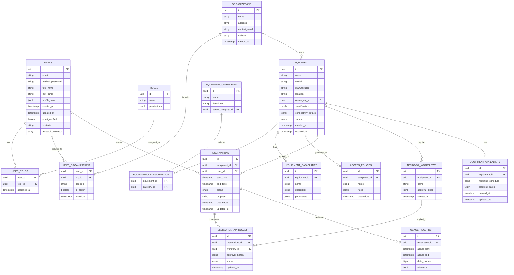
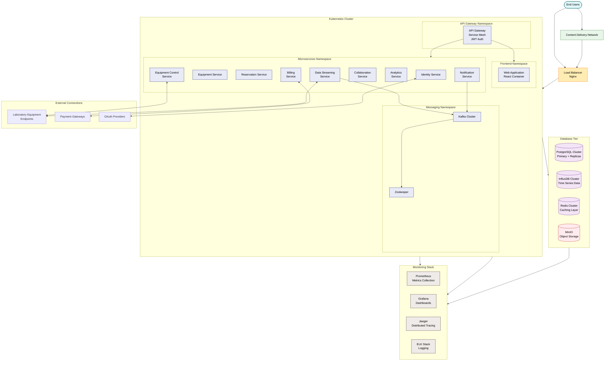
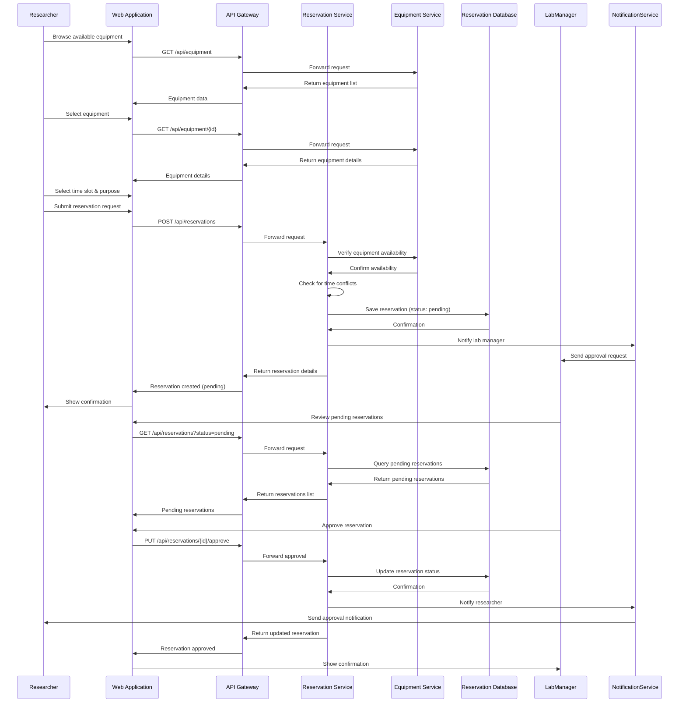

# Open Science Collaboration Hub Architecture

```mermaid
graph TB
    %% STYLES
    classDef client fill:#E0F7FA,stroke:#006064,color:black
    classDef gateway fill:#E8F5E9,stroke:#2E7D32,color:black
    classDef service fill:#FFF8E1,stroke:#FF8F00,color:black
    classDef database fill:#F3E5F5,stroke:#6A1B9A,color:black
    classDef cache fill:#E8EAF6,stroke:#1A237E,color:black
    classDef storage fill:#FFEBEE,stroke:#B71C1C,color:black
    classDef externalSystem fill:#EFEBE9,stroke:#3E2723,color:black

    %% CLIENT LAYER
    subgraph ClientLayer["Client Layer"]
        WebApp["Web Application\n(React, TypeScript, Material UI)"]:::client
        MobileApp["Mobile Application\n(React Native)"]:::client
        EquipmentControls["Equipment Control Interfaces\n(WebRTC, Canvas API)"]:::client
    end

    %% API GATEWAY
    subgraph GatewayLayer["API Gateway Layer"]
        ApiGateway["API Gateway\n(Express.js, JWT Auth)"]:::gateway
        LoadBalancer["Load Balancer\n(Nginx)"]:::gateway
    end

    %% SERVICES LAYER
    subgraph ServicesLayer["Microservices Layer"]
        subgraph CoreServices["Core Services"]
            IdentityService["Identity Service\n(Node.js, Passport.js)"]:::service
            EquipmentService["Equipment Registry Service\n(Node.js, Express)"]:::service
            ReservationService["Reservation Service\n(Node.js, Express)"]:::service
        end
        
        subgraph OperationalServices["Operational Services"]
            EquipmentControlService["Equipment Control Service\n(Python, Flask, IoT protocols)"]:::service
            DataStreamingService["Data Streaming Service\n(Kafka, Spark)"]:::service
            CollaborationService["Collaboration Service\n(Node.js, Socket.IO)"]:::service
        end
        
        subgraph SupportServices["Support Services"]
            AnalyticsService["Analytics Service\n(Python, TensorFlow)"]:::service
            NotificationService["Notification Service\n(Node.js, Redis)"]:::service
            BillingService["Billing Service\n(Node.js, Stripe)"]:::service
        end
    end

    %% DATA LAYER
    subgraph DataLayer["Data Layer"]
        subgraph Databases["Databases"]
            UserDB["User Database\n(PostgreSQL)"]:::database
            EquipmentDB["Equipment Database\n(PostgreSQL)"]:::database
            ReservationDB["Reservation Database\n(PostgreSQL + TimescaleDB)"]:::database
            TimeSeriesDB["Time Series Database\n(InfluxDB)"]:::database
        end
        
        subgraph Caching["Caching"]
            Redis["Redis\n(Caching, Pub/Sub)"]:::cache
        end
        
        subgraph ObjectStorage["Object Storage"]
            MinIO["MinIO\n(S3-compatible storage)"]:::storage
        end
    end

    %% EXTERNAL SYSTEMS
    subgraph ExternalSystems["External Systems"]
        LabEquipment["Laboratory Equipment\n(Various protocols)"]:::externalSystem
        PaymentProcessors["Payment Processors\n(Stripe, PayPal)"]:::externalSystem
        IdentityProviders["Identity Providers\n(OAuth, SAML)"]:::externalSystem
        DataRepositories["External Data Repositories\n(DOI services)"]:::externalSystem
    end

    %% CONNECTIONS
    %% Client to Gateway
    WebApp --> ApiGateway
    MobileApp --> ApiGateway
    EquipmentControls --> ApiGateway

    %% Gateway to Services
    ApiGateway --> LoadBalancer
    LoadBalancer --> IdentityService
    LoadBalancer --> EquipmentService
    LoadBalancer --> ReservationService
    LoadBalancer --> EquipmentControlService
    LoadBalancer --> DataStreamingService
    LoadBalancer --> CollaborationService
    LoadBalancer --> AnalyticsService
    LoadBalancer --> NotificationService
    LoadBalancer --> BillingService

    %% Services to Databases
    IdentityService --> UserDB
    EquipmentService --> EquipmentDB
    ReservationService --> ReservationDB
    EquipmentControlService --> EquipmentDB
    DataStreamingService --> TimeSeriesDB
    AnalyticsService --> UserDB
    AnalyticsService --> EquipmentDB
    AnalyticsService --> ReservationDB
    AnalyticsService --> TimeSeriesDB
    NotificationService --> UserDB
    BillingService --> ReservationDB

    %% Services to Redis
    IdentityService --> Redis
    CollaborationService --> Redis
    NotificationService --> Redis

    %% Services to Storage
    DataStreamingService --> MinIO
    CollaborationService --> MinIO

    %% Services to External Systems
    EquipmentControlService <--> LabEquipment
    DataStreamingService <--> LabEquipment
    BillingService --> PaymentProcessors
    IdentityService --> IdentityProviders
    CollaborationService --> DataRepositories
```

## Data Flow Architecture

```mermaid
flowchart TD
    %% STYLES
    classDef user fill:#E0F7FA,stroke:#006064,color:black
    classDef equipment fill:#FFF8E1,stroke:#FF8F00,color:black
    classDef manager fill:#E8F5E9,stroke:#2E7D32,color:black
    classDef system fill:#F3E5F5,stroke:#6A1B9A,color:black

    %% ACTORS
    Researcher[Researcher]:::user
    LabManager[Laboratory Manager]:::manager
    EquipmentNode[Laboratory Equipment]:::equipment
    
    %% PLATFORM COMPONENTS
    WebApp[Web Application]:::system
    MobileApp[Mobile Application]:::system
    APIGateway[API Gateway]:::system
    
    IdentityService[Identity Service]:::system
    EquipmentService[Equipment Service]:::system
    ReservationService[Reservation Service]:::system
    ControlService[Equipment Control Service]:::system
    DataService[Data Streaming Service]:::system
    
    %% DATA STORES
    UserDB[(User Database)]:::system
    EquipmentDB[(Equipment Database)]:::system
    ReservationDB[(Reservation Database)]:::system
    TimeSeriesDB[(Time Series Database)]:::system
    ObjectStorage[(Object Storage)]:::system
    
    %% CRITICAL WORKFLOWS
    
    %% 1. Equipment Discovery & Catalog
    Researcher -->|1. Logs in| WebApp
    WebApp -->|Authenticates| APIGateway
    APIGateway -->|Validates token| IdentityService
    IdentityService -->|Checks credentials| UserDB
    Researcher -->|2. Searches equipment| WebApp
    WebApp -->|Sends search query| APIGateway
    APIGateway -->|Routes query| EquipmentService
    EquipmentService -->|Retrieves matching equipment| EquipmentDB
    EquipmentDB -->|Returns results| EquipmentService
    EquipmentService -->|Returns equipment list| WebApp
    
    %% 2. Reservation Workflow
    Researcher -->|3. Selects equipment| WebApp
    WebApp -->|Displays details| WebApp
    Researcher -->|4. Creates reservation request| WebApp
    WebApp -->|Submits reservation| APIGateway
    APIGateway -->|Routes request| ReservationService
    ReservationService -->|Checks availability| ReservationDB
    ReservationService -->|Stores reservation| ReservationDB
    ReservationService -->|Notifies lab manager| LabManager
    LabManager -->|5. Reviews request| WebApp
    WebApp -->|Shows pending requests| APIGateway
    APIGateway -->|Gets pending requests| ReservationService
    LabManager -->|6. Approves/Rejects| WebApp
    WebApp -->|Submits decision| APIGateway
    APIGateway -->|Updates reservation| ReservationService
    ReservationService -->|Updates status| ReservationDB
    ReservationService -->|Notifies researcher| Researcher
    
    %% 3. Equipment Usage Workflow
    Researcher -->|7. Starts session at reserved time| WebApp
    WebApp -->|Initializes connection| APIGateway
    APIGateway -->|Starts usage tracking| ReservationService
    ReservationService -->|Records start time| ReservationDB
    APIGateway -->|Establishes equipment control| ControlService
    ControlService <-->|Control commands| EquipmentNode
    EquipmentNode -->|Sends data| DataService
    DataService -->|Stores measurements| TimeSeriesDB
    DataService -->|Streams results| WebApp
    Researcher -->|8. Ends session| WebApp
    WebApp -->|Terminates connection| APIGateway
    APIGateway -->|Ends usage tracking| ReservationService
    ReservationService -->|Records completion| ReservationDB
    DataService -->|Archives experiment data| ObjectStorage
```

## Database Schema Design

```mermaid
erDiagram
    %% USER MANAGEMENT
    USERS {
        uuid id PK
        string email
        string hashed_password
        string first_name
        string last_name
        jsonb profile_data
        timestamp created_at
        timestamp updated_at
        boolean email_verified
        string institution
        array research_interests
    }
    
    ROLES {
        uuid id PK
        string name
        jsonb permissions
    }
    
    USER_ROLES {
        uuid user_id FK
        uuid role_id FK
        timestamp assigned_at
    }
    
    ORGANIZATIONS {
        uuid id PK
        string name
        string address
        string contact_email
        string website
        timestamp created_at
    }
    
    USER_ORGANIZATIONS {
        uuid user_id FK
        uuid org_id FK
        string position
        boolean is_admin
        timestamp joined_at
    }
    
    %% EQUIPMENT MANAGEMENT
    EQUIPMENT {
        uuid id PK
        string name
        string model
        string manufacturer
        string location
        uuid owner_org_id FK
        jsonb specifications
        jsonb connectivity_details
        enum status
        timestamp created_at
        timestamp updated_at
    }
    
    EQUIPMENT_CATEGORIES {
        uuid id PK
        string name
        string description
        uuid parent_category_id FK
    }
    
    EQUIPMENT_CATEGORIZATION {
        uuid equipment_id FK
        uuid category_id FK
    }
    
    EQUIPMENT_CAPABILITIES {
        uuid id PK
        uuid equipment_id FK
        string name
        string description
        jsonb parameters
    }
    
    ACCESS_POLICIES {
        uuid id PK
        uuid equipment_id FK
        string name
        jsonb rules
        timestamp created_at
    }
    
    %% RESERVATION MANAGEMENT
    RESERVATIONS {
        uuid id PK
        uuid equipment_id FK
        uuid user_id FK
        timestamp start_time
        timestamp end_time
        enum status
        string purpose
        timestamp created_at
        timestamp updated_at
    }
    
    APPROVAL_WORKFLOWS {
        uuid id PK
        uuid equipment_id FK
        string name
        jsonb approval_steps
        timestamp created_at
    }
    
    RESERVATION_APPROVALS {
        uuid id PK
        uuid reservation_id FK
        uuid workflow_id FK
        jsonb approval_history
        enum status
        timestamp updated_at
    }
    
    EQUIPMENT_AVAILABILITY {
        uuid id PK
        uuid equipment_id FK
        jsonb recurring_schedule
        array blackout_dates
        timestamp created_at
        timestamp updated_at
    }
    
    USAGE_RECORDS {
        uuid id PK
        uuid reservation_id FK
        timestamp actual_start
        timestamp actual_end
        bigint data_volume
        jsonb telemetry
    }
    
    %% RELATIONSHIPS
    USERS ||--o{ USER_ROLES : has
    ROLES ||--o{ USER_ROLES : assigned_to
    ORGANIZATIONS ||--o{ USER_ORGANIZATIONS : includes
    USERS ||--o{ USER_ORGANIZATIONS : belongs_to
    ORGANIZATIONS ||--o{ EQUIPMENT : owns
    EQUIPMENT ||--o{ EQUIPMENT_CATEGORIZATION : categorized_as
    EQUIPMENT_CATEGORIES ||--o{ EQUIPMENT_CATEGORIZATION : includes
    EQUIPMENT ||--o{ EQUIPMENT_CAPABILITIES : has
    EQUIPMENT ||--o{ ACCESS_POLICIES : governed_by
    EQUIPMENT ||--o{ RESERVATIONS : booked_for
    USERS ||--o{ RESERVATIONS : makes
    EQUIPMENT ||--o{ APPROVAL_WORKFLOWS : requires
    RESERVATIONS ||--o{ RESERVATION_APPROVALS : undergoes
    APPROVAL_WORKFLOWS ||--o{ RESERVATION_APPROVALS : applied_to
    EQUIPMENT ||--o{ EQUIPMENT_AVAILABILITY : has
    RESERVATIONS ||--o{ USAGE_RECORDS : generates
```

## Deployment Architecture

```mermaid
flowchart TB
    %% STYLES
    classDef client fill:#E0F7FA,stroke:#006064,color:black
    classDef cdn fill:#E8F5E9,stroke:#2E7D32,color:black
    classDef loadbalancer fill:#FFECB3,stroke:#FF6F00,color:black
    classDef k8s fill:#E8EAF6,stroke:#1A237E,color:black
    classDef database fill:#F3E5F5,stroke:#6A1B9A,color:black
    classDef storage fill:#FFEBEE,stroke:#B71C1C,color:black
    classDef monitoring fill:#EFEBE9,stroke:#3E2723,color:black

    %% CLIENT CONNECTIONS
    Client([End Users]):::client --> CDN
    Client --> LB

    %% FRONTEND DELIVERY
    CDN[Content Delivery Network]:::cdn --> LB

    %% LOAD BALANCING
    LB[Load Balancer\nNginx]:::loadbalancer --> K8S

    %% KUBERNETES CLUSTER
    subgraph K8S [Kubernetes Cluster]
        %% NAMESPACES
        subgraph FE [Frontend Namespace]
            WebApp[Web Application\nReact Container]:::k8s
        end

        subgraph API [API Gateway Namespace]
            Gateway[API Gateway\nService Mesh\nJWT Auth]:::k8s
        end

        subgraph Svc [Microservices Namespace]
            Identity[Identity Service]:::k8s
            Equipment[Equipment Service]:::k8s
            Reservation[Reservation Service]:::k8s
            Control[Equipment Control\nService]:::k8s
            Data[Data Streaming\nService]:::k8s
            Collab[Collaboration\nService]:::k8s
            Analytics[Analytics\nService]:::k8s
            Notification[Notification\nService]:::k8s
            Billing[Billing\nService]:::k8s
        end

        subgraph Msg [Messaging Namespace]
            Kafka[Kafka Cluster]:::k8s
            KafkaZK[Zookeeper]:::k8s
        end
    end

    %% DATABASE TIER
    subgraph DB [Database Tier]
        PostgreSQL[(PostgreSQL Cluster\nPrimary + Replicas)]:::database
        InfluxDB[(InfluxDB Cluster\nTime Series Data)]:::database
        Redis[(Redis Cluster\nCaching Layer)]:::database
        MinIO[(MinIO\nObject Storage)]:::storage
    end

    %% MONITORING & OBSERVABILITY
    subgraph MON [Monitoring Stack]
        Prometheus[Prometheus\nMetrics Collection]:::monitoring
        Grafana[Grafana\nDashboards]:::monitoring
        Jaeger[Jaeger\nDistributed Tracing]:::monitoring
        ELK[ELK Stack\nLogging]:::monitoring
    end

    %% EXTERNAL CONNECTIONS
    subgraph EXT [External Connections]
        LabEquipment[Laboratory Equipment\nEndpoints]
        PaymentGateway[Payment Gateways]
        OAuth[OAuth Providers]
    end

    %% CONNECTIONS WITHIN K8S
    Gateway --> FE
    Gateway --> Svc
    
    %% SERVICES TO KAFKA
    Data --> Kafka
    Notification --> Kafka
    Kafka --> KafkaZK

    %% K8S TO DATABASES
    K8S --> DB
    K8S --> MON

    %% EXTERNAL CONNECTIONS
    Control <--> LabEquipment
    Data <--> LabEquipment
    Billing <--> PaymentGateway
    Identity <--> OAuth
    
    %% MONITORING CONNECTIONS
    K8S --> MON
    DB --> MON
```

## Sequence Diagram: Reservation Workflow

```mermaid
sequenceDiagram
    participant Researcher
    participant WebApp as Web Application
    participant API as API Gateway
    participant ResService as Reservation Service
    participant EqService as Equipment Service
    participant ResDB as Reservation Database
    participant LabManager
    participant NotificationService

    %% EQUIPMENT SELECTION
    Researcher->>WebApp: Browse available equipment
    WebApp->>API: GET /api/equipment
    API->>EqService: Forward request
    EqService->>API: Return equipment list
    API->>WebApp: Equipment data
    Researcher->>WebApp: Select equipment
    WebApp->>API: GET /api/equipment/{id}
    API->>EqService: Forward request
    EqService->>API: Return equipment details
    API->>WebApp: Equipment details

    %% RESERVATION CREATION
    Researcher->>WebApp: Select time slot & purpose
    Researcher->>WebApp: Submit reservation request
    WebApp->>API: POST /api/reservations
    API->>ResService: Forward request
    
    ResService->>EqService: Verify equipment availability
    EqService->>ResService: Confirm availability
    
    ResService->>ResService: Check for time conflicts
    ResService->>ResDB: Save reservation (status: pending)
    ResDB->>ResService: Confirmation
    
    ResService->>NotificationService: Notify lab manager
    NotificationService->>LabManager: Send approval request
    ResService->>API: Return reservation details
    API->>WebApp: Reservation created (pending)
    WebApp->>Researcher: Show confirmation

    %% APPROVAL PROCESS
    LabManager->>WebApp: Review pending reservations
    WebApp->>API: GET /api/reservations?status=pending
    API->>ResService: Forward request
    ResService->>ResDB: Query pending reservations
    ResDB->>ResService: Return pending reservations
    ResService->>API: Return reservations list
    API->>WebApp: Pending reservations
    
    LabManager->>WebApp: Approve reservation
    WebApp->>API: PUT /api/reservations/{id}/approve
    API->>ResService: Forward approval
    ResService->>ResDB: Update reservation status
    ResDB->>ResService: Confirmation
    
    ResService->>NotificationService: Notify researcher
    NotificationService->>Researcher: Send approval notification
    ResService->>API: Return updated reservation
    API->>WebApp: Reservation approved
    WebApp->>LabManager: Show confirmation
``` 