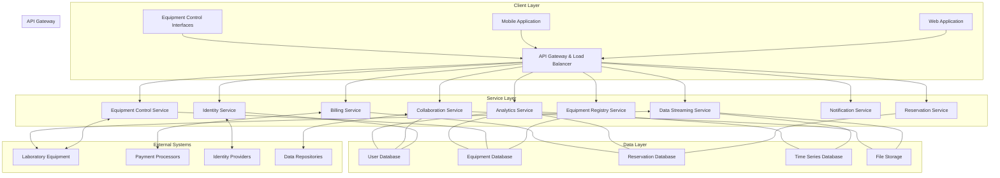
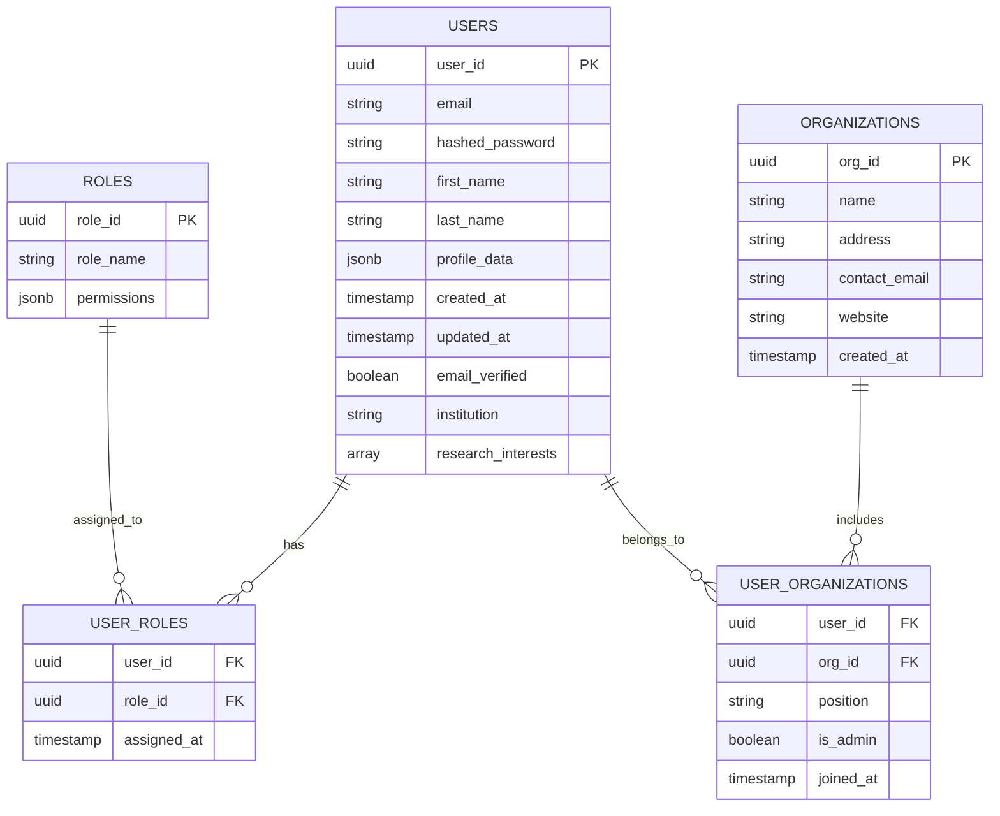
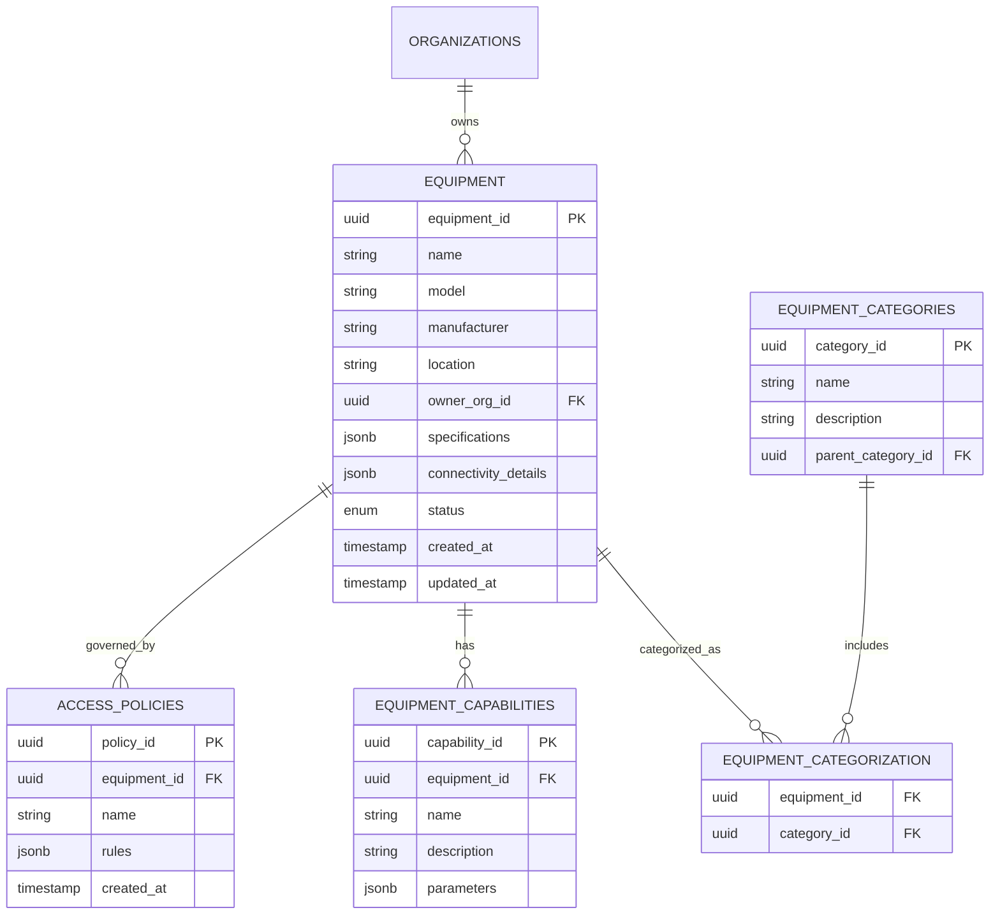
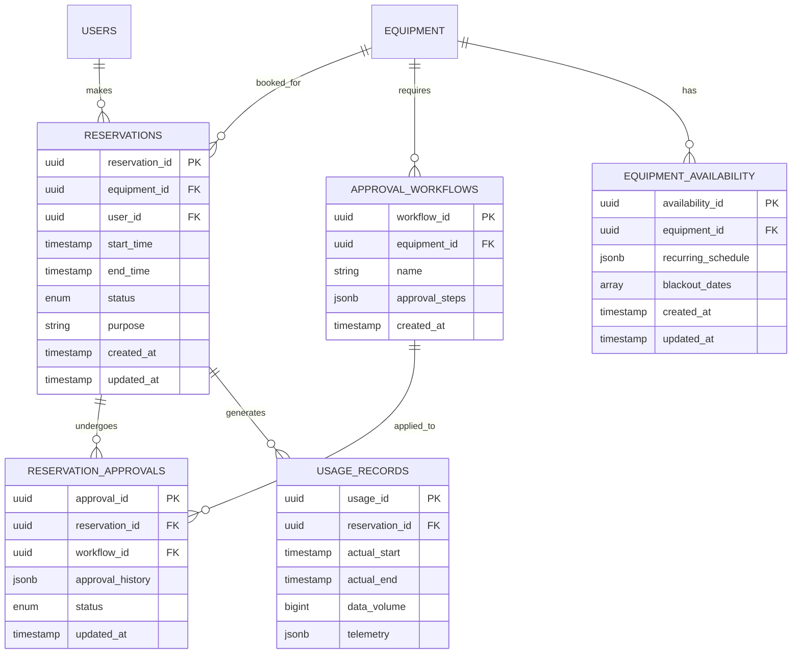

# Open Science Collaboration Hub: System Design Document

## 1. System Overview and Scope

The Open Science Collaboration Hub transforms how scientific research is conducted by connecting researchers with remote laboratory equipment across institutional boundaries. This platform allows scientists to reserve, operate, and collect data from specialized instruments remotely, while collaborating in real-time with peers worldwide.

Scientific research faces critical bottlenecks: expensive equipment concentrated in wealthy institutions, difficulty reproducing experiments, and siloed expertise. Our system breaks these barriers by creating a network of shareable scientific instruments accessible to researchers regardless of location or institutional affiliation.

### Problem Statement
Research equipment costing hundreds of thousands to millions of dollars sits idle in laboratories around the world, while researchers elsewhere lack access to the tools they need. The traditional solution—traveling to use equipment or sending samples—is inefficient, expensive, and unsustainable.

### Solution
Create a platform that connects scientific instruments to the internet and enables researchers to:
- Discover available equipment worldwide
- Reserve time on instruments
- Remotely control equipment through standardized interfaces
- Collect and analyze data in real-time with collaborators
- Share and reproduce experimental protocols

### Target Users
- **Research Scientists**: Looking to access specialized equipment not available at their institution
- **Laboratory Managers**: Seeking to increase utilization of expensive equipment and generate additional funding
- **Research Institutions**: Wanting to foster collaboration and maximize return on equipment investments
- **Industry Researchers**: Needing occasional access to specialized equipment without full purchase
- **Students and Educators**: Learning to use advanced equipment through remote access

### Scope
**Within Scope:**
- Equipment discovery and reservation system
- Remote equipment operation interfaces
- Real-time data collection and visualization
- Collaborative workspace for analysis
- Experiment protocol sharing and versioning
- User authentication and authorization
- Usage reporting and billing

**Out of Scope:**
- Physical instrument maintenance
- Shipping of physical samples
- Direct financial transactions between institutions (handled externally)
- Long-term data storage beyond project completion
- Custom interface development for every type of scientific equipment

## 2. Functional and Non-Functional Requirements

### Functional Requirements

#### For Research Scientists
- Create accounts with profiles highlighting expertise and research interests
- Browse and search equipment catalog by type, specifications, location, and availability
- Book equipment time slots with automatic time zone adjustment
- Operate instruments remotely through web-based control interfaces
- View instrument output (images, data streams, measurements) in real-time
- Record and download experimental data in standard formats
- Invite collaborators to observe experiments or analyze results together
- Create step-by-step experiment protocols with version control
- Clone and modify others' experiment protocols with proper attribution
- Share results publicly or with specific collaborators
- Export data to external repositories with DOI (Digital Object Identifier) assignments

#### For Laboratory Managers
- Register laboratory equipment with detailed specifications and operating parameters
- Connect instruments to the platform via standardized IoT interfaces
- Set availability schedules and usage policies
- Review and approve/deny equipment reservation requests
- Monitor remote equipment usage in real-time
- Set safety limits and emergency shutdown procedures
- Generate usage reports and analytics
- Configure pricing models (per-hour, subscription, credit-based, or free)
- Manage access levels for different equipment functions

#### For System Administrators
- Manage user accounts and roles
- Review and approve new equipment registrations
- Monitor system performance and resource utilization
- Handle support requests from users
- Generate platform analytics and usage statistics

### Non-Functional Requirements

#### Performance
- Equipment control latency under 200ms for responsive manipulation
- Data streaming capable of handling 100MB/s for high-resolution sensors
- Support for 500+ concurrent users across different experiments
- Web interface loading times under 2 seconds
- Search results returned in under 1 second

#### Reliability
- 99.9% uptime for core reservation and authentication systems
- Graceful degradation during partial outages
- Automatic recovery of experiment data during connection interruptions
- Regular system backups with 15-minute Recovery Point Objective (RPO)
- Recovery Time Objective (RTO) of 1 hour for critical systems

#### Scalability
- Support for 10,000+ registered instruments globally
- Capability to handle 100,000+ registered users
- Storage for petabytes of experimental data
- Ability to add new equipment types without system modifications

#### Security
- End-to-end encryption for all data transmission
- Role-based access control for equipment and data
- Comprehensive audit logging for all system activities
- Compliance with regional data protection regulations (GDPR, HIPAA, etc.)
- Penetration testing and security audits before public release

#### Usability
- Intuitive interfaces requiring minimal training
- Consistent design language across all platform sections
- Mobile-responsive design for monitoring experiments on the go
- Accessibility compliance with WCAG 2.1 standards
- Multi-language support for global accessibility

## 3. High-Level Architecture

The Open Science Collaboration Hub employs a microservices architecture to enable flexibility, scalability, and resilience. The system is built on cloud infrastructure to ensure global availability with low latency.



### System Components Overview

- **Client Layer**: Provides user interfaces for different stakeholders and devices
- **API Gateway**: Manages routing, authentication, and rate limiting for all services
- **Service Layer**: Contains specialized microservices for different system functions
- **Data Layer**: Stores different types of data in appropriate database systems
- **External Systems**: Integrates with equipment, payment services, and other platforms

### Data Flow

1. Scientists browse the equipment catalog and make reservations
2. Laboratory managers approve reservation requests
3. During the reserved time slot, scientists connect to and control the equipment
4. Data from the equipment streams to the platform in real-time
5. Collaborators can join to view experiments and analyze data
6. Results are stored, processed, and can be exported to external repositories
7. Usage metrics are tracked for reporting and billing purposes

This architecture balances the need for real-time interactivity with scientific equipment against the requirements for data security, collaborative analysis, and system scalability.

## 4. Component Breakdown

### Client Layer Components

#### Web Application
- **Technologies**: React, TypeScript, Material UI
- **Responsibilities**: Provide the primary user interface for all platform functions
- **Key Features**: Responsive design, real-time data visualization, collaborative editing
- **Communication**: REST and GraphQL APIs with WebSocket for real-time updates

#### Mobile Application
- **Technologies**: React Native
- **Responsibilities**: Provide mobile access for monitoring and notifications
- **Key Features**: Push notifications, experiment status tracking, basic analytics
- **Communication**: REST APIs with WebSocket for real-time updates

#### Equipment Control Interfaces
- **Technologies**: WebRTC, Canvas API, equipment-specific SDKs
- **Responsibilities**: Provide intuitive controls for different equipment types
- **Key Features**: Low-latency controls, video feeds, real-time feedback
- **Communication**: WebRTC for video, WebSocket for control commands

### Service Layer Components

#### Identity Service
- **Technologies**: Node.js, Passport.js, JWT
- **Responsibilities**: Handle authentication, authorization, and user profiles
- **Key Features**: OAuth integration, role-based access control, audit logging
- **Communication**: REST APIs, database connections
- **Dependencies**: User Database, External Identity Providers

#### Equipment Registry Service
- **Technologies**: Java, Spring Boot
- **Responsibilities**: Manage equipment catalog, specifications, and availability
- **Key Features**: Advanced search, categorization, specification standardization
- **Communication**: REST APIs, database connections
- **Dependencies**: Equipment Database

#### Reservation Service
- **Technologies**: Java, Spring Boot, Quartz
- **Responsibilities**: Handle scheduling, reservations, and calendar management
- **Key Features**: Conflict resolution, time zone handling, approval workflows
- **Communication**: REST APIs, message queue, database connections
- **Dependencies**: Reservation Database, Equipment Database, Notification Service

#### Equipment Control Service
- **Technologies**: Python, Flask, IoT protocols (MQTT, OPC-UA)
- **Responsibilities**: Translate web commands to equipment control protocols
- **Key Features**: Protocol adaptation, command validation, safety monitoring
- **Communication**: WebSocket, MQTT, OPC-UA, REST APIs
- **Dependencies**: Equipment Database, laboratory equipment

#### Data Streaming Service
- **Technologies**: Kafka, Spark Streaming, Python
- **Responsibilities**: Collect, process, and distribute real-time experimental data
- **Key Features**: High-throughput data handling, format conversion, buffering
- **Communication**: Kafka topics, WebSocket, REST APIs
- **Dependencies**: Time Series Database, File Storage, laboratory equipment

#### Collaboration Service
- **Technologies**: Node.js, Socket.IO, Redis
- **Responsibilities**: Enable real-time collaboration on experiments and analysis
- **Key Features**: Shared sessions, collaborative editing, chat, annotations
- **Communication**: WebSocket, REST APIs, database connections
- **Dependencies**: User Database, File Storage

#### Analytics Service
- **Technologies**: Python, TensorFlow, pandas
- **Responsibilities**: Process experimental data, generate insights, track metrics
- **Key Features**: Data visualization, statistical analysis, machine learning
- **Communication**: REST APIs, database connections
- **Dependencies**: Time Series Database, User Database, Equipment Database

#### Notification Service
- **Technologies**: Node.js, Redis, SendGrid, Twilio
- **Responsibilities**: Deliver system notifications through various channels
- **Key Features**: Email, SMS, in-app notifications, delivery confirmation
- **Communication**: Message queue, REST APIs, database connections
- **Dependencies**: User Database, Reservation Database

#### Billing Service
- **Technologies**: Node.js, Stripe API
- **Responsibilities**: Track usage, generate invoices, process payments
- **Key Features**: Multiple pricing models, institutional billing, credit systems
- **Communication**: REST APIs, database connections
- **Dependencies**: Reservation Database, User Database, Payment Processors

### Data Layer Components

#### User Database
- **Technology**: PostgreSQL
- **Data Stored**: User profiles, credentials, roles, research interests
- **Access Patterns**: High read, moderate write, complex queries
- **Scaling Strategy**: Vertical scaling with read replicas

#### Equipment Database
- **Technology**: PostgreSQL
- **Data Stored**: Equipment metadata, specifications, availability, connection details
- **Access Patterns**: High read, low write, complex queries with filtering
- **Scaling Strategy**: Vertical scaling with read replicas

#### Reservation Database
- **Technology**: PostgreSQL with TimescaleDB extension
- **Data Stored**: Reservations, schedules, usage records
- **Access Patterns**: Moderate read/write, time-based queries
- **Scaling Strategy**: Partitioning by time periods

#### Time Series Database
- **Technology**: InfluxDB
- **Data Stored**: Experimental measurements, sensor readings, equipment telemetry
- **Access Patterns**: High write, moderate read, time-range queries
- **Scaling Strategy**: Horizontal scaling with data partitioning

#### File Storage
- **Technology**: MinIO (S3-compatible object storage)
- **Data Stored**: Experimental results, protocol documents, images, video recordings
- **Access Patterns**: Write once, read many, possibly large files
- **Scaling Strategy**: Horizontal scaling with sharding

## 5. Data Storage and Database Schema

### User Data Model (PostgreSQL)



### Equipment Data Model (PostgreSQL)



### Reservation Data Model (PostgreSQL with TimescaleDB)



### Experimental Data Model (InfluxDB)

InfluxDB is a time-series database optimized for high write and query loads with time-stamped data. The data model uses:

- **Measurements**: Equipment readings, sensor data, control commands
- **Tags**: Equipment ID, experiment ID, user ID, parameter names
- **Fields**: Actual measurement values, status indicators
- **Timestamps**: When the measurement was taken

Example data point:
```
measurement: temperature_reading
tags: equipment_id=123, experiment_id=456, sensor=main_chamber
fields: value=98.6, units=celsius, status=normal
timestamp: 2023-05-01T15:30:00Z
```

### File Storage Structure (MinIO)

MinIO provides S3-compatible object storage for experimental files:

- **Buckets**: Organized by experiment ID
- **Objects**: Raw data files, processed results, protocol documents, media
- **Metadata**: File type, creator, timestamps, associated equipment
- **Versioning**: Enabled for tracking changes

### Database Access Patterns and Optimization

#### User Database
- **Indexing**: Indexes on email, institution, and research_interests for fast lookups
- **Queries**: Primarily lookup by ID or email, filtering by institution or interests
- **Caching**: User profiles cached in Redis with 15-minute TTL

#### Equipment Database
- **Indexing**: Multi-column indexes on category, location, and specifications
- **Queries**: Complex filtering on specifications, category, and availability
- **Denormalization**: Common query paths denormalized for performance

#### Reservation Database
- **Partitioning**: Partitioned by month for efficient time-range queries
- **Indexing**: Indexes on equipment_id, user_id, and time ranges
- **Constraints**: Enforces non-overlapping reservations per equipment

#### Time Series Database
- **Retention Policies**: Raw data retained for 30 days, downsampled data for 1 year
- **Continuous Queries**: Automatic downsampling for long-term storage
- **Sharding**: Distributed across multiple nodes by equipment type

#### File Storage
- **Lifecycle Policies**: Automatic archiving of older files to cold storage
- **Caching**: Edge caching for frequently accessed files
- **Access Control**: Pre-signed URLs for temporary access

## 6. Technology Stack Choices and Reasoning

### Frontend Technologies

#### React with TypeScript
- **Reasoning**: Strong typing reduces bugs in complex scientific interfaces
- **Alternatives Considered**: Vue.js, Angular
- **Advantages**: Large ecosystem, component reusability, strong developer community

#### Material UI
- **Reasoning**: Comprehensive component library with scientific UI elements
- **Alternatives Considered**: Tailwind CSS, Chakra UI
- **Advantages**: Accessible by default, consistent design language, customizable

#### WebRTC
- **Reasoning**: Enables low-latency video streaming from equipment cameras
- **Alternatives Considered**: HLS, DASH
- **Advantages**: Lower latency, peer-to-peer capabilities, widely supported

#### D3.js and Plotly
- **Reasoning**: Powerful visualization libraries for scientific data
- **Alternatives Considered**: Chart.js, Highcharts
- **Advantages**: Flexibility for complex scientific visualizations, interactive features

### Backend Technologies

#### Node.js with Express
- **Reasoning**: Efficient for API services with asynchronous I/O operations
- **Alternatives Considered**: Django, Ruby on Rails
- **Advantages**: Non-blocking I/O, JavaScript across stack, extensive package ecosystem

#### Java with Spring Boot
- **Reasoning**: Robust for critical services requiring strong typing and reliability
- **Alternatives Considered**: Go, Kotlin
- **Advantages**: Mature ecosystem, enterprise-grade libraries, strong concurrency

#### Python with Flask
- **Reasoning**: Ideal for data processing with scientific Python ecosystem
- **Alternatives Considered**: FastAPI, Django
- **Advantages**: Integration with scientific libraries (NumPy, pandas, scikit-learn)

#### Kafka
- **Reasoning**: Reliable message broker for high-throughput data streaming
- **Alternatives Considered**: RabbitMQ, NATS
- **Advantages**: Scalability, persistence, replay capabilities, partitioning

### Database Technologies

#### PostgreSQL
- **Reasoning**: Reliable relational database with advanced features
- **Alternatives Considered**: MySQL, SQL Server
- **Advantages**: JSON support, extensibility, sophisticated query planner

#### TimescaleDB
- **Reasoning**: Time-series extension for PostgreSQL optimized for temporal data
- **Alternatives Considered**: Custom partitioning in PostgreSQL
- **Advantages**: Automated time partitioning, specialized time-series functions

#### InfluxDB
- **Reasoning**: Purpose-built for high-velocity time series data from instruments
- **Alternatives Considered**: TimescaleDB, Prometheus
- **Advantages**: Optimized for time-series writes and queries, built-in downsampling

#### Redis
- **Reasoning**: In-memory data structure store for caching and real-time features
- **Alternatives Considered**: Memcached
- **Advantages**: Versatility, pub/sub capabilities, data structures

#### MinIO
- **Reasoning**: S3-compatible object storage for experimental files
- **Alternatives Considered**: Direct S3, Azure Blob Storage
- **Advantages**: Self-hostable, S3 compatibility, scalability

### Infrastructure Technologies

#### Kubernetes
- **Reasoning**: Container orchestration for microservices architecture
- **Alternatives Considered**: Docker Swarm, Nomad
- **Advantages**: Industry standard, extensive ecosystem, sophisticated scaling

#### Istio
- **Reasoning**: Service mesh for secure microservice communication
- **Alternatives Considered**: Linkerd, Consul
- **Advantages**: Traffic management, security policies, observability

#### Prometheus and Grafana
- **Reasoning**: Monitoring and visualization for system metrics
- **Alternatives Considered**: Datadog, New Relic
- **Advantages**: Open-source, specialized for Kubernetes, extensive integrations

#### Terraform
- **Reasoning**: Infrastructure as code for multi-cloud deployment
- **Alternatives Considered**: CloudFormation, Pulumi
- **Advantages**: Cloud-agnostic, declarative, extensive provider ecosystem

## 7. Non-Functional Requirements Implementation

### Scalability

The system architecture is designed to scale horizontally to accommodate growth in users, equipment, and data volume:

#### User Growth Strategy
- **Stateless Services**: All API services are stateless, allowing horizontal scaling
- **Load Balancing**: Kubernetes-managed load balancers distribute traffic
- **Database Scaling**: Read replicas for user and equipment databases
- **Connection Pooling**: Efficient database connection management

#### Data Volume Strategy
- **Time Series Partitioning**: Automatic sharding of time series data by equipment and time
- **Hot/Warm/Cold Architecture**: Data automatically moves to appropriate storage tiers
- **Stream Processing**: Kafka enables parallel processing of high-volume data streams
- **Selective Persistence**: Only relevant data points stored long-term

#### Compute Resource Management
- **Autoscaling**: Services automatically scale based on CPU, memory, and custom metrics
- **Resource Quotas**: Prevents any single tenant from consuming excessive resources
- **Graceful Degradation**: Non-essential features disabled during peak loads
- **Background Processing**: Heavy computational tasks offloaded to worker pools

#### Technical Implementation
- Horizontal pod autoscalers in Kubernetes resize service instances based on load
- Database connection pooling with PgBouncer prevents connection exhaustion
- Redis cache reduces database load for frequently accessed data
- Data partitioning strategies in all databases optimize for growth

### Security

Security is paramount when dealing with potentially sensitive scientific data and controlling laboratory equipment:

#### Authentication and Authorization
- **Multi-factor Authentication**: Required for sensitive operations
- **OAuth Integration**: Support for institutional single sign-on
- **JWT Tokens**: Secure, short-lived access tokens
- **Role-Based Access Control**: Granular permissions for equipment and data
- **Attribute-Based Policies**: Dynamic authorization based on user, equipment, and context

#### Data Protection
- **End-to-End Encryption**: TLS for all communications
- **At-Rest Encryption**: All databases and file storage encrypted
- **PII Handling**: Personal information isolated and specially protected
- **Data Classification**: Automated labeling based on sensitivity
- **Anonymization**: Options for de-identifying research data

#### Infrastructure Security
- **Network Segmentation**: Microservices isolated in security domains
- **Container Scanning**: Automatic vulnerability detection
- **Secret Management**: HashiCorp Vault for secure credential storage
- **Immutable Infrastructure**: Regularly rebuilt from verified images
- **Principle of Least Privilege**: Minimized service account permissions

#### Technical Implementation
- TLS termination at API gateway with modern cipher suites
- Regular automated security scanning with OWASP tools
- IP-based rate limiting to prevent brute force attacks
- Comprehensive audit logging for security events
- Multi-layered defense with network policies, WAF, and IDS

### Reliability

The system must maintain high availability despite potential failures in network, services, or equipment:

#### Fault Tolerance
- **Circuit Breakers**: Prevent cascading failures between services
- **Retry Mechanisms**: Automatic retry with exponential backoff
- **Fallback Strategies**: Graceful degradation when dependencies fail
- **Bulkhead Pattern**: Failure isolation between system components

#### Data Resilience
- **Database Replication**: Synchronous replication for critical data
- **Regular Backups**: Automated with point-in-time recovery
- **Conflict Resolution**: Strategies for concurrent modifications
- **Data Validation**: Schema enforcement and integrity checks

#### Monitoring and Recovery
- **Health Checks**: Proactive monitoring of all services
- **Alerting**: Automated notification for anomalies
- **Self-healing**: Automatic restart of failed components
- **Chaos Engineering**: Regular resilience testing

#### Technical Implementation
- Multi-region deployment for geographic redundancy
- Database failover configurations with automatic promotion
- Kafka's replication and persistence for reliable messaging
- Comprehensive logging with distributed tracing (Jaeger)
- Prometheus alerting for proactive issue detection

## 8. Potential Trade-offs and Limitations

### Architecture Trade-offs

#### Microservices vs. Monolith
- **Decision**: Microservices architecture
- **Benefits**: Independent scaling, technology flexibility, fault isolation
- **Drawbacks**: Increased operational complexity, network overhead, distributed debugging challenges
- **Mitigation**: Service mesh for observability, standardized communication patterns

#### Real-time vs. Batch Processing
- **Decision**: Hybrid approach with prioritized real-time for critical paths
- **Benefits**: Low latency for equipment control, efficient resource use for analytics
- **Drawbacks**: Increased system complexity, potential data consistency challenges
- **Mitigation**: Clear separation of concerns, event sourcing patterns

#### SQL vs. NoSQL
- **Decision**: Multi-database approach (PostgreSQL + InfluxDB + MinIO)
- **Benefits**: Right tool for each data type, optimized performance
- **Drawbacks**: Increased operational overhead, cross-database transaction limitations
- **Mitigation**: Careful domain boundary design, eventual consistency where appropriate

### Performance Trade-offs

#### Consistency vs. Availability
- **Decision**: Strong consistency for reservations, eventual consistency for analytics
- **Benefits**: Guaranteed reservation integrity, high availability for non-critical paths
- **Drawbacks**: Potential performance impact on transactional operations
- **Mitigation**: Caching strategies, optimistic concurrency control

#### Data Retention vs. Storage Costs
- **Decision**: Tiered storage with automatic downsampling
- **Benefits**: Cost-effective long-term storage, full-fidelity recent data
- **Drawbacks**: Potential loss of detail in historical data
- **Mitigation**: User-configurable retention policies, selective high-resolution storage

#### Generic vs. Specialized Interfaces
- **Decision**: Core generic interface with plugin architecture for specialization
- **Benefits**: Broad equipment support, extensibility for specific needs
- **Drawbacks**: Potential compromises in specialized functionality
- **Mitigation**: Comprehensive SDK for custom interface development

### Known Limitations

#### Equipment Compatibility
- **Limitation**: Not all scientific equipment has remote control capabilities
- **Impact**: Some instruments may require additional hardware adapters
- **Future Direction**: Partner with manufacturers for native integration

#### Network Constraints
- **Limitation**: Dependency on reliable, low-latency internet connectivity
- **Impact**: Potential challenges in regions with limited infrastructure
- **Future Direction**: Offline operation modes and edge computing solutions

#### Regulatory Compliance
- **Limitation**: Varying requirements across regions and research domains
- **Impact**: May limit usage in highly regulated fields (e.g., clinical research)
- **Future Direction**: Domain-specific compliance modules and certifications

#### Scalability Ceiling
- **Limitation**: Upper bounds on simultaneous video streams and control sessions
- **Impact**: May require reservation limits during peak periods
- **Future Direction**: Advanced compression, peer-to-peer streaming technologies

## Implementation Plan (20-30% of System)

For the initial implementation, we will focus on the core functionality that demonstrates the system's architecture and validates key design decisions:

### Phase 1: Core Infrastructure
1. **User Authentication Service**: OAuth-based authentication with role management
2. **Equipment Registry Service**: Basic equipment catalog with search functionality
3. **Reservation System**: Time slot booking with approval workflows
4. **Basic UI**: Equipment discovery, reservation, and user profile management

### Phase 2: Remote Control Foundation
1. **Equipment Control Service**: Generic control interface with WebSocket communication
2. **Data Streaming Service**: Real-time data collection and visualization
3. **Protocol Storage**: Basic experiment protocol creation and sharing
4. **Enhanced UI**: Equipment control panels and data visualization

### Phase 3: Collaboration Features
1. **Collaboration Service**: Shared sessions for experiment observation
2. **Chat and Annotation**: Real-time communication during experiments
3. **Data Export**: Basic data download and sharing capabilities
4. **Complete UI**: Integrated collaboration features in the web application

The implementation will prioritize end-to-end functionality over feature completeness, demonstrating the full system flow from equipment discovery to data collection and sharing.

## Conclusion

The Open Science Collaboration Hub represents a transformative approach to scientific research, breaking down barriers between institutions and democratizing access to specialized equipment. The system's architecture balances the competing needs of real-time control, data security, and collaborative analysis while providing a foundation for future expansion.

By implementing this design, we create not just a software system but an ecosystem that can accelerate scientific discovery and foster collaboration across geographic and institutional boundaries. The modular, scalable architecture ensures the platform can grow with increasing adoption and evolve to meet the changing needs of the scientific community. 