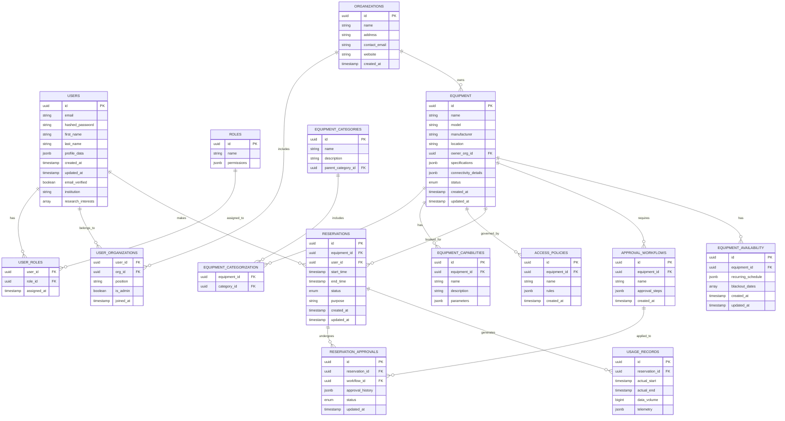
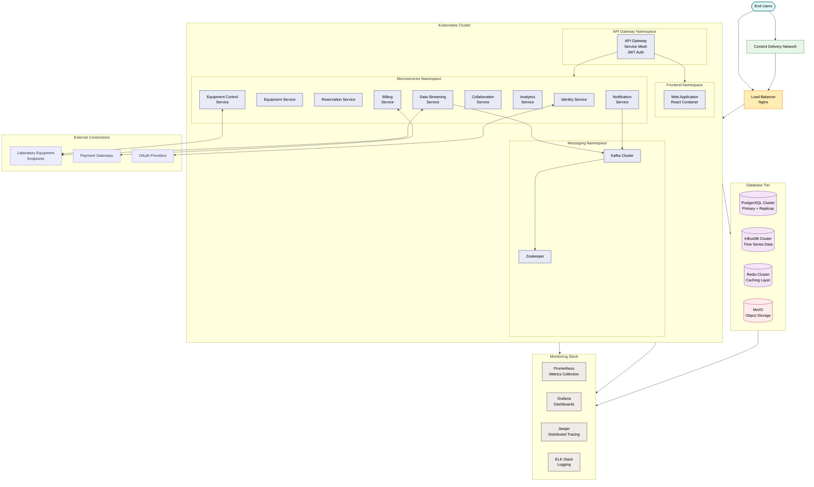
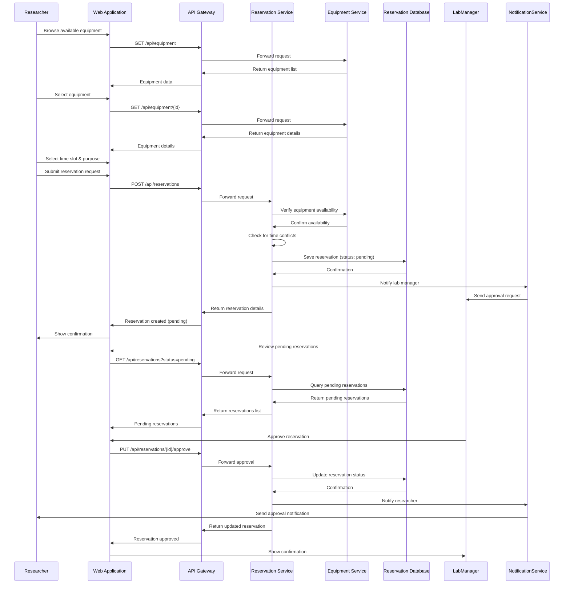

# Open Science Collaboration Hub: System Design

## 1. Introduction

Scientific research faces critical bottlenecks today: expensive equipment concentrated in wealthy institutions, difficulty reproducing experiments, and siloed expertise. The Open Science Collaboration Hub aims to solve these problems by creating a platform that connects researchers with remote laboratory equipment across institutional boundaries.

This platform allows scientists to discover available equipment worldwide, reserve time on instruments, remotely control equipment through standardized interfaces, collect and analyze data in real-time with collaborators, and share experimental protocols.

## 2. Functional and Non-Functional Requirements

### 2.1 Functional Requirements

The Open Science Collaboration Hub must support a variety of user interactions and system operations across different user roles. These requirements describe the specific capabilities the system must provide.

#### 2.1.1 User Management and Authentication

- **User Registration**: Scientists, laboratory managers, and administrators must be able to create accounts with appropriate profile information.
- **Authentication**: The system must authenticate users through username/password or institutional SSO.
- **Role-Based Access**: Different permissions must be assigned based on user roles (Researcher, Laboratory Manager, Administrator).
- **Profile Management**: Users must be able to manage their profiles, including research interests, institutional affiliation, and contact information.
- **Organization Management**: Laboratory managers must be able to create and manage organizational profiles for their institutions.

#### 2.1.2 Equipment Management

- **Equipment Registration**: Laboratory managers must be able to register equipment with detailed specifications, photos, and usage policies.
- **Equipment Discovery**: Researchers must be able to search and browse available equipment using filters for type, specifications, location, and availability.
- **Equipment Details**: The system must display comprehensive equipment information, including technical specifications, availability calendar, and usage policies.
- **Equipment Categories**: Equipment must be organized in hierarchical categories for easier discovery.
- **Equipment Status Tracking**: The system must track equipment status (available, under maintenance, in use) in real-time.

#### 2.1.3 Reservation System

- **Availability Display**: Researchers must be able to view equipment availability on a calendar interface.
- **Reservation Creation**: Researchers must be able to request time slots on specific equipment, providing purpose and requirements.
- **Approval Workflow**: Laboratory managers must be able to review, approve, or reject reservation requests with comments.
- **Conflict Prevention**: The system must prevent double-booking and reservation conflicts.
- **Reservation Management**: Users must be able to view, modify, and cancel their existing reservations based on the reservation status.
- **Notification System**: Automatic notifications must be sent for reservation status changes, upcoming sessions, and other important events.

#### 2.1.4 Remote Equipment Operation

- **Remote Connection**: Researchers must be able to connect to equipment during their reserved time slots.
- **Control Interface**: Equipment-specific control interfaces must be provided for remote operation.
- **Video Streaming**: Live video feeds from equipment cameras must be available during sessions.
- **Data Collection**: Researchers must be able to collect and download data generated during experiments.
- **Session Recording**: Sessions must be recordable for later review and documentation.
- **Emergency Controls**: Laboratory staff must have override capabilities for safety and emergency situations.

#### 2.1.5 Collaboration Features

- **Session Sharing**: Researchers must be able to invite colleagues to view or participate in active sessions.
- **Real-Time Communication**: Text chat and video conferencing must be available during shared sessions.
- **Data Sharing**: Experiment data must be sharable with specific collaborators or made public.
- **Protocol Sharing**: Researchers must be able to create, version, and share experimental protocols.
- **Result Annotation**: Users must be able to annotate results and images with comments and markers.

#### 2.1.6 Administration and Reporting

- **Usage Analytics**: Laboratory managers must have access to equipment usage statistics and reports.
- **System Monitoring**: Administrators must be able to monitor system performance and service health.
- **Billing Management**: The platform must support various billing models for equipment usage.
- **Access Control**: Administrators must be able to manage system-wide access policies and permissions.
- **Audit Logging**: All significant system actions must be logged for security and accountability.

### 2.2 Non-Functional Requirements

Non-functional requirements define the overall qualities and performance characteristics the system must exhibit.

#### 2.2.1 Performance

- **Response Time**: The web interface must load in under 2 seconds for standard operations.
- **Equipment Control Latency**: Remote control operations must have less than 200ms latency for responsive manipulation.
- **Data Streaming**: The system must support data streaming rates of up to 100MB/s for high-resolution sensors.
- **Concurrent Users**: The platform must support 500+ concurrent users across different experiments.
- **Search Performance**: Search results must be returned in under 1 second.

#### 2.2.2 Scalability

- **Horizontal Scaling**: Services must scale horizontally to handle increasing load.
- **Equipment Growth**: The system must support 10,000+ registered instruments globally.
- **User Growth**: The platform must accommodate growth to 100,000+ registered users.
- **Data Volume**: Storage systems must handle petabytes of experimental data.
- **Geographic Distribution**: The architecture must support global distribution of users and equipment.

#### 2.2.3 Reliability

- **System Uptime**: Core services must maintain 99.9% uptime.
- **Data Durability**: Experimental data must have 99.999% durability.
- **Fault Tolerance**: The system must continue functioning when individual components fail.
- **Backup & Recovery**: Regular automated backups with 15-minute Recovery Point Objective (RPO).
- **Graceful Degradation**: Non-essential features must degrade gracefully during peak loads.

#### 2.2.4 Security

- **Data Encryption**: All data must be encrypted in transit and at rest.
- **Authentication**: Multi-factor authentication must be available for sensitive operations.
- **Authorization**: Fine-grained access controls must be enforced for all resources.
- **Vulnerability Management**: Regular security testing and prompt patching of vulnerabilities.
- **Compliance**: Adherence to relevant data protection regulations (GDPR, HIPAA, etc.).

#### 2.2.5 Usability

- **Intuitive Interface**: The system must be usable with minimal training.
- **Accessibility**: Interfaces must comply with WCAG 2.1 AA standards.
- **Responsive Design**: The web application must function well on devices with different screen sizes.
- **Internationalization**: Support for multiple languages and time zones.
- **Documentation**: Comprehensive user documentation and context-sensitive help.

## 3. System Architecture Overview

The Open Science Collaboration Hub employs a microservices architecture to enable flexibility, scalability, and resilience. Each component handles specific aspects of the platform, communicating through well-defined APIs.

### 3.1 Architectural Philosophy and Patterns

Our architecture follows several key design principles that shape how the system is built and operated:

**Domain-Driven Design (DDD)**: The system is decomposed into bounded contexts that align with distinct business domains (identity management, equipment registry, reservations, etc.). Each microservice owns its data model and business logic, reducing coupling between services. This approach allows teams to develop, deploy, and scale each service independently.

**Event-Driven Architecture**: Critical system events (reservation created, equipment status changed, etc.) are published to message queues, allowing interested services to respond asynchronously. This pattern improves system resilience and enables complex workflows that span multiple services without tight coupling.

**API Gateway Pattern**: All client requests flow through a central API gateway that handles cross-cutting concerns like authentication, routing, and rate limiting. This simplifies the client experience while providing a consistent interface to the underlying services.

**CQRS (Command Query Responsibility Segregation)**: For performance-critical services, we separate read operations (queries) from write operations (commands). This allows us to optimize each path independently, using fast caches for reads while ensuring transactional consistency for writes.

**Circuit Breaker Pattern**: Services use circuit breakers when communicating with other services or external systems. This prevents cascading failures by quickly failing requests when a dependency is unhealthy, rather than allowing requests to pile up.

### 3.2 System Components and Interactions

```mermaid
graph TB
    %% STYLES
    classDef client fill:#E0F7FA,stroke:#006064,color:black
    classDef gateway fill:#E8F5E9,stroke:#2E7D32,color:black
    classDef service fill:#FFF8E1,stroke:#FF8F00,color:black
    classDef database fill:#F3E5F5,stroke:#6A1B9A,color:black
    classDef cache fill:#E8EAF6,stroke:#1A237E,color:black
    classDef storage fill:#FFEBEE,stroke:#B71C1C,color:black
    classDef externalSystem fill:#EFEBE9,stroke:#3E2723,color:black

    %% CLIENT LAYER
    subgraph ClientLayer["Client Layer"]
        WebApp["Web Application\n(React, TypeScript, Material UI)"]:::client
        MobileApp["Mobile Application\n(React Native)"]:::client
        EquipmentControls["Equipment Control Interfaces\n(WebRTC, Canvas API)"]:::client
    end

    %% API GATEWAY
    subgraph GatewayLayer["API Gateway Layer"]
        ApiGateway["API Gateway\n(Express.js, JWT Auth)"]:::gateway
        LoadBalancer["Load Balancer\n(Nginx)"]:::gateway
    end

    %% SERVICES LAYER
    subgraph ServicesLayer["Microservices Layer"]
        subgraph CoreServices["Core Services"]
            IdentityService["Identity Service\n(Node.js, Passport.js)"]:::service
            EquipmentService["Equipment Registry Service\n(Node.js, Express)"]:::service
            ReservationService["Reservation Service\n(Node.js, Express)"]:::service
        end
        
        subgraph OperationalServices["Operational Services"]
            EquipmentControlService["Equipment Control Service\n(Python, Flask, IoT protocols)"]:::service
            DataStreamingService["Data Streaming Service\n(Kafka, Spark)"]:::service
            CollaborationService["Collaboration Service\n(Node.js, Socket.IO)"]:::service
        end
        
        subgraph SupportServices["Support Services"]
            AnalyticsService["Analytics Service\n(Python, TensorFlow)"]:::service
            NotificationService["Notification Service\n(Node.js, Redis)"]:::service
            BillingService["Billing Service\n(Node.js, Stripe)"]:::service
        end
    end

    %% DATA LAYER
    subgraph DataLayer["Data Layer"]
        subgraph Databases["Databases"]
            UserDB["User Database\n(PostgreSQL)"]:::database
            EquipmentDB["Equipment Database\n(PostgreSQL)"]:::database
            ReservationDB["Reservation Database\n(PostgreSQL + TimescaleDB)"]:::database
            TimeSeriesDB["Time Series Database\n(InfluxDB)"]:::database
        end
        
        subgraph Caching["Caching"]
            Redis["Redis\n(Caching, Pub/Sub)"]:::cache
        end
        
        subgraph ObjectStorage["Object Storage"]
            MinIO["MinIO\n(S3-compatible storage)"]:::storage
        end
    end

    %% EXTERNAL SYSTEMS
    subgraph ExternalSystems["External Systems"]
        LabEquipment["Laboratory Equipment\n(Various protocols)"]:::externalSystem
        PaymentProcessors["Payment Processors\n(Stripe, PayPal)"]:::externalSystem
        IdentityProviders["Identity Providers\n(OAuth, SAML)"]:::externalSystem
        DataRepositories["External Data Repositories\n(DOI services)"]:::externalSystem
    end

    %% CONNECTIONS
    %% Client to Gateway
    WebApp --> ApiGateway
    MobileApp --> ApiGateway
    EquipmentControls --> ApiGateway

    %% Gateway to Services
    ApiGateway --> LoadBalancer
    LoadBalancer --> IdentityService
    LoadBalancer --> EquipmentService
    LoadBalancer --> ReservationService
    LoadBalancer --> EquipmentControlService
    LoadBalancer --> DataStreamingService
    LoadBalancer --> CollaborationService
    LoadBalancer --> AnalyticsService
    LoadBalancer --> NotificationService
    LoadBalancer --> BillingService

    %% Services to Databases
    IdentityService --> UserDB
    EquipmentService --> EquipmentDB
    ReservationService --> ReservationDB
    EquipmentControlService --> EquipmentDB
    DataStreamingService --> TimeSeriesDB
    AnalyticsService --> UserDB
    AnalyticsService --> EquipmentDB
    AnalyticsService --> ReservationDB
    AnalyticsService --> TimeSeriesDB
    NotificationService --> UserDB
    BillingService --> ReservationDB

    %% Services to Redis
    IdentityService --> Redis
    CollaborationService --> Redis
    NotificationService --> Redis

    %% Services to Storage
    DataStreamingService --> MinIO
    CollaborationService --> MinIO

    %% Services to External Systems
    EquipmentControlService <--> LabEquipment
    DataStreamingService <--> LabEquipment
    BillingService --> PaymentProcessors
    IdentityService --> IdentityProviders
    CollaborationService --> DataRepositories
```

Let's explore each layer of our architecture in detail:

#### 3.2.1 Client Layer

The client layer provides interfaces for different user types to interact with the platform:

**Web Application**: Built with React and TypeScript, the web app is the primary interface for all users. It employs Material UI components for a consistent, accessible design language. The application uses React Router for navigation, Redux for state management, and Axios for API communication. For real-time features, it leverages WebSockets to maintain persistent connections with the server.

**Mobile Application**: A React Native application sharing core business logic with the web app through a common TypeScript codebase. This provides a native mobile experience while reducing duplication of effort. The mobile app primarily focuses on monitoring reservations and receiving notifications, with limited equipment control capabilities.

**Equipment Control Interfaces**: Specialized interfaces for remote equipment operation. These are dynamically loaded based on equipment type and use WebRTC for low-latency video streaming from lab cameras. Canvas-based custom control panels provide intuitive manipulation of equipment parameters. These interfaces are backed by equipment-specific JavaScript libraries that translate user actions into standardized API commands.

#### 3.2.2 API Gateway Layer

The API Gateway serves as the entry point for all client requests and handles several cross-cutting concerns:

**Authentication and Authorization**: Validates JWT tokens, extracts user identity and roles, and enforces access policies. Unauthenticated requests are rejected here before reaching downstream services.

**Request Routing**: Routes requests to appropriate backend services based on URL paths and HTTP methods. This routing layer allows the internal service architecture to evolve without impacting clients.

**Request Transformation**: Transforms client requests and service responses as needed, allowing backward compatibility as the API evolves.

**Rate Limiting**: Protects services from excessive traffic by limiting request rates per user or IP address.

**Logging and Monitoring**: Records request metrics and logs activity for troubleshooting and analytics.

**Load Balancing**: Distributes traffic across multiple instances of each service to ensure optimal resource utilization and availability.

The gateway is built on Express.js with custom middleware for each concern. For load balancing, we use Nginx as a reverse proxy, which also handles TLS termination and initial request buffering.

#### 3.2.3 Microservices Layer

Our services are organized into three functional groups:

**Core Services** form the foundation of the platform:

- **Identity Service**: Manages user accounts, authentication, and authorization. Built with Node.js and Passport.js, it supports local username/password authentication as well as OAuth integration with institutional identity providers. JWT tokens are issued upon successful authentication, with configurable expiration and refresh policies. User profiles store research interests and institutional affiliation, facilitating equipment discovery and collaboration.

- **Equipment Registry Service**: Maintains the catalog of available instruments with comprehensive metadata. Equipment specifications are stored in a flexible JSON format to accommodate diverse instrument types, from microscopes to mass spectrometers. The service supports complex queries based on equipment capabilities, availability, and location. It also manages equipment categories and relationships between related instruments.

- **Reservation Service**: Handles the booking system, approval workflows, and usage tracking. Reservations undergo validation to prevent conflicts and ensure equipment availability. The approval workflow is configurable per equipment, from simple automatic approval to multi-step processes involving different stakeholders. This service is critical to the platform's core functionality and has been implemented as part of the initial 25% scope.

**Operational Services** enable remote equipment usage:

- **Equipment Control Service**: The bridge between web interfaces and laboratory instruments. This Python-based service uses adapters to communicate with different equipment protocols (MQTT, OPC-UA, proprietary APIs). Commands from researchers are validated against equipment specifications and safety parameters before execution. The service maintains stateful sessions for each active connection and implements watchdog timers to detect and handle client disconnections.

- **Data Streaming Service**: Manages real-time data flow from instruments to users. Built on Kafka for high-throughput message processing, it handles various data types from simple measurements to complex imagery. The service implements automatic downsampling for high-frequency data and provides both raw and processed data streams to clients.

- **Collaboration Service**: Enables multiple researchers to work together during equipment sessions. Using Socket.IO for real-time communication, it synchronizes control panel states across participants, manages access permissions within sessions, and provides text and voice chat capabilities. The service also handles session recording for later playback and analysis.

**Support Services** provide additional platform capabilities:

- **Analytics Service**: Processes experimental data and generates insights. This Python-based service leverages scientific computing libraries (NumPy, pandas) and machine learning tools (TensorFlow) to help researchers analyze results. It also tracks platform usage metrics to identify popular equipment and usage patterns.

- **Notification Service**: Delivers system notifications through various channels. It manages delivery preferences, message templates, and delivery confirmation. Notifications include reservation status changes, upcoming sessions, and system announcements.

- **Billing Service**: Handles usage accounting and payment processing. Different billing models are supported, from simple hourly rates to institutional subscriptions or credit-based systems. The service integrates with payment processors for commercial usage while also supporting internal accounting for institutional users.

#### 3.2.4 Data Layer

Our data layer employs different database technologies optimized for specific data types and access patterns:

**Relational Databases (PostgreSQL)**: Store structured data with complex relationships and transaction requirements. We use separate databases for different domains:
- User DB: User profiles, roles, and organizational data
- Equipment DB: Equipment metadata, specifications, and categorization
- Reservation DB: Booking information, approval workflows, and usage records

**Time Series Database (InfluxDB)**: Optimized for high-frequency measurement data from scientific instruments. This database efficiently handles time-stamped data with automatic downsampling and retention policies.

**Caching Layer (Redis)**: Provides in-memory caching to reduce database load for frequently accessed data, such as equipment listings and user profiles. Redis also supports pub/sub messaging for real-time notifications.

**Object Storage (MinIO)**: Provides S3-compatible storage for experimental results, images, and documents. This handles large binary files outside the database, with versioning support and fine-grained access control.

#### 3.2.5 External Systems

The platform integrates with various external systems:

**Laboratory Equipment**: Physical scientific instruments connected through various protocols. These range from simple HTTP APIs to specialized protocols like OPC-UA for industrial equipment or vendor-specific SDKs.

**Payment Processors**: External payment services like Stripe and PayPal for handling commercial usage fees.

**Identity Providers**: Institutional SSO systems using protocols like OAuth or SAML, allowing researchers to use their existing credentials.

**Data Repositories**: External scientific data repositories for publishing experiment results with permanent DOIs (Digital Object Identifiers).

### 3.3 Communication Patterns

Services in our architecture communicate through several patterns, each chosen based on the interaction requirements:

**Synchronous REST APIs**: Most service-to-service communication uses HTTP-based REST APIs with JSON payloads. These provide a simple, stateless interaction model with well-defined request/response cycles. Services expose versioned APIs with comprehensive OpenAPI documentation.

**Asynchronous Messaging**: For event-driven workflows, services publish events to Kafka topics. This allows loose coupling between event producers and consumers, enabling complex workflows without direct service dependencies. Common events include reservation status changes, equipment availability updates, and user notifications.

**WebSockets**: Real-time features like equipment control and collaboration use WebSocket connections for bi-directional communication. These persistent connections reduce latency and allow servers to push updates to clients as they occur.

**gRPC**: For high-performance internal service communication with structured data, we use gRPC with Protocol Buffers. This is particularly important for data-intensive interactions between the Equipment Control Service and Data Streaming Service.

**Database Change Data Capture**: Some services subscribe to database change streams (using PostgreSQL logical replication) to react to data changes without direct service coupling.

### 3.4 Security Architecture

Security is embedded throughout our architecture:

**Zero Trust Model**: All service-to-service communication is authenticated and authorized, even within the internal network. No service implicitly trusts another without verification.

**Defense in Depth**: Multiple security controls are implemented at different layers, from network isolation to application-level authorization checks.

**Least Privilege**: Services operate with minimal permissions needed for their function. For example, the Equipment Control Service can only access equipment it's explicitly authorized to control.

**Secure by Default**: All communications are encrypted by default. Sensitive data is encrypted at rest with service-specific keys.

**Identity Propagation**: User identity and permissions flow through the entire request chain, allowing fine-grained access control at each service.

The architecture combines these principles to create a secure, flexible platform that can evolve as requirements change and the user base grows.

## 4. Core Workflows and Data Flow

The platform supports three primary workflows: equipment discovery, reservation management, and remote operation. The following diagram illustrates how data flows through the system during these workflows:

```mermaid
flowchart TD
    %% STYLES
    classDef user fill:#E0F7FA,stroke:#006064,color:black
    classDef equipment fill:#FFF8E1,stroke:#FF8F00,color:black
    classDef manager fill:#E8F5E9,stroke:#2E7D32,color:black
    classDef system fill:#F3E5F5,stroke:#6A1B9A,color:black

    %% ACTORS
    Researcher[Researcher]:::user
    LabManager[Laboratory Manager]:::manager
    EquipmentNode[Laboratory Equipment]:::equipment
    
    %% PLATFORM COMPONENTS
    WebApp[Web Application]:::system
    MobileApp[Mobile Application]:::system
    APIGateway[API Gateway]:::system
    
    IdentityService[Identity Service]:::system
    EquipmentService[Equipment Service]:::system
    ReservationService[Reservation Service]:::system
    ControlService[Equipment Control Service]:::system
    DataService[Data Streaming Service]:::system
    
    %% DATA STORES
    UserDB[(User Database)]:::system
    EquipmentDB[(Equipment Database)]:::system
    ReservationDB[(Reservation Database)]:::system
    TimeSeriesDB[(Time Series Database)]:::system
    ObjectStorage[(Object Storage)]:::system
    
    %% CRITICAL WORKFLOWS
    
    %% 1. Equipment Discovery & Catalog
    Researcher -->|1. Logs in| WebApp
    WebApp -->|Authenticates| APIGateway
    APIGateway -->|Validates token| IdentityService
    IdentityService -->|Checks credentials| UserDB
    Researcher -->|2. Searches equipment| WebApp
    WebApp -->|Sends search query| APIGateway
    APIGateway -->|Routes query| EquipmentService
    EquipmentService -->|Retrieves matching equipment| EquipmentDB
    EquipmentDB -->|Returns results| EquipmentService
    EquipmentService -->|Returns equipment list| WebApp
    
    %% 2. Reservation Workflow
    Researcher -->|3. Selects equipment| WebApp
    WebApp -->|Displays details| WebApp
    Researcher -->|4. Creates reservation request| WebApp
    WebApp -->|Submits reservation| APIGateway
    APIGateway -->|Routes request| ReservationService
    ReservationService -->|Checks availability| ReservationDB
    ReservationService -->|Stores reservation| ReservationDB
    ReservationService -->|Notifies lab manager| LabManager
    LabManager -->|5. Reviews request| WebApp
    WebApp -->|Shows pending requests| APIGateway
    APIGateway -->|Gets pending requests| ReservationService
    LabManager -->|6. Approves/Rejects| WebApp
    WebApp -->|Submits decision| APIGateway
    APIGateway -->|Updates reservation| ReservationService
    ReservationService -->|Updates status| ReservationDB
    ReservationService -->|Notifies researcher| Researcher
    
    %% 3. Equipment Usage Workflow
    Researcher -->|7. Starts session at reserved time| WebApp
    WebApp -->|Initializes connection| APIGateway
    APIGateway -->|Starts usage tracking| ReservationService
    ReservationService -->|Records start time| ReservationDB
    APIGateway -->|Establishes equipment control| ControlService
    ControlService <-->|Control commands| EquipmentNode
    EquipmentNode -->|Sends data| DataService
    DataService -->|Stores measurements| TimeSeriesDB
    DataService -->|Streams results| WebApp
    Researcher -->|8. Ends session| WebApp
    WebApp -->|Terminates connection| APIGateway
    APIGateway -->|Ends usage tracking| ReservationService
    ReservationService -->|Records completion| ReservationDB
    DataService -->|Archives experiment data| ObjectStorage
```

### 4.1 Equipment Discovery Workflow

Researchers browse or search for equipment based on type, specifications, or availability. The Equipment Service manages the catalog of available instruments, with detailed specifications and availability information.

### 4.2 Reservation Workflow

Once a researcher finds suitable equipment, they submit a reservation request specifying the purpose and desired time slot. The request goes through an approval process managed by laboratory personnel responsible for the equipment.

The Reservation Service handles:
- Checking for time conflicts with existing reservations
- Managing the approval workflow
- Notifying relevant parties about reservation status changes
- Tracking equipment usage during scheduled sessions

### 4.3 Remote Operation Workflow

During their reserved time slot, researchers connect to the equipment through web interfaces. The Equipment Control Service translates standardized web commands to equipment-specific protocols, while the Data Streaming Service handles real-time data collection and distribution.

## 5. Data Model

The system uses a relational database schema to store user data, equipment information, and reservation details. Time-series data from equipment is stored in a specialized database optimized for measurements and telemetry.

The data model is organized into three main sections:

1. **User Management**: User accounts, roles, permissions, and organizational affiliations
2. **Equipment Management**: Equipment details, categories, capabilities, and access policies
3. **Reservation Management**: Reservations, approvals, availability, and usage records

## 6. Technology Stack and Implementation Details

### 6.1 Frontend

- **Web Application**: React with TypeScript and Material UI
- **Mobile Application**: React Native (planned for future implementation)
- **Equipment Control Interfaces**: WebRTC for video streams, Canvas API for interactive controls

### 6.2 Backend Services

- **API Gateway**: Node.js with Express
- **Identity Service**: Node.js with Passport.js and JWT for authentication
- **Equipment Service**: Node.js with Express
- **Reservation Service**: Node.js with Express and database transaction support
- **Equipment Control Service**: Python with Flask (planned for future implementation)
- **Data Streaming Service**: Kafka and Spark (planned for future implementation)

### 6.3 Databases

- **PostgreSQL**: For user data, equipment details, and reservations
- **TimescaleDB**: PostgreSQL extension for time-series data (usage patterns)
- **InfluxDB**: For high-frequency measurement data (planned for future implementation)
- **Redis**: For caching and message queuing
- **MinIO**: S3-compatible object storage for experimental data (planned for future implementation)

### 6.4 Deployment

The system uses Docker containers orchestrated with Docker Compose for development and testing. For production, the system is designed to deploy on Kubernetes:

## 7. Current Implementation Scope

For this system design project, I've implemented approximately 25% of the platform, focusing on the core services:

1. **Identity Service**: User authentication with JWT tokens and role-based access control
2. **Equipment Service**: Equipment registry with search functionality
3. **Reservation Service**: Booking system with approval workflows
4. **API Gateway**: Service routing and composition
5. **Web Frontend**: Basic interfaces for equipment discovery and reservation

The implementation demonstrates the microservices architecture and the core workflows of equipment discovery, reservation, and approval.

### 7.1 Reservation Service Implementation Detail

The Reservation Service is a key component that demonstrates the system's core functionality. It includes:

- **Models**: Reservations, approvals, and usage records with proper relationships
- **Controllers**: Business logic for creating, approving, and managing reservations
- **Routes**: REST API endpoints with authentication middleware
- **Middleware**: JWT validation and role-based access control

The service implements important business rules like preventing overlapping reservations and enforcing approval workflows. It uses database transactions to ensure data consistency across related entities.

### 7.2 Sequence Diagrams for Key Processes

The reservation and approval process follows this sequence:

## 8. Non-Functional Requirements

### 8.1 Scalability

The system is designed to scale with increasing users, equipment, and data volume:

- **Horizontal Scaling**: Stateless services can scale horizontally behind load balancers
- **Database Scaling**: Read replicas for user and equipment databases
- **Data Partitioning**: Time-series data is partitioned by equipment and time periods
- **Caching**: Redis cache reduces database load for frequently accessed data

### 8.2 Security

Security is critical for a system handling scientific data and equipment control:

- **Authentication**: JWT-based tokens with proper expiration and refresh mechanisms
- **Authorization**: Role-based access control with granular permissions
- **Data Protection**: TLS for all communications, encryption for sensitive data at rest
- **Input Validation**: All user inputs are validated to prevent injection attacks
- **Audit Logging**: Actions affecting reservations and equipment are logged

### 8.3 Reliability

The system maintains high availability through:

- **Fault Isolation**: Microservices architecture limits the scope of failures
- **Circuit Breakers**: Prevent cascading failures between services
- **Database Redundancy**: Replication for critical databases
- **Graceful Degradation**: Non-essential features can be disabled during peak loads
- **Monitoring**: Comprehensive health checks and alerting

## 9. Conclusion and Future Work

The Open Science Collaboration Hub addresses a critical need in the scientific community by connecting researchers with remote laboratory equipment. The implemented components demonstrate the core architecture and workflows, providing a foundation for the complete platform.

Future development will focus on:

1. **Equipment Control Interfaces**: Building standardized interfaces for different equipment types
2. **Data Streaming**: Implementing real-time data collection and visualization
3. **Collaboration Tools**: Adding features for multiple researchers to work together
4. **Protocol Sharing**: Developing a system for documenting and sharing experimental procedures

This platform has the potential to democratize access to scientific equipment, accelerate research progress, and foster collaboration across institutional boundaries. 