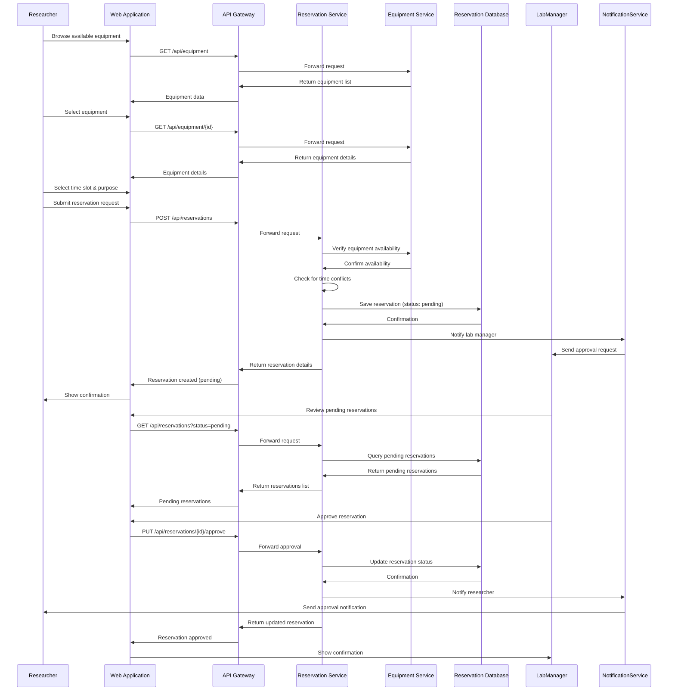

```mermaid
graph TB
    %% STYLES
    classDef client fill:#E0F7FA,stroke:#006064,color:black
    classDef gateway fill:#E8F5E9,stroke:#2E7D32,color:black
    classDef service fill:#FFF8E1,stroke:#FF8F00,color:black
    classDef database fill:#F3E5F5,stroke:#6A1B9A,color:black
    classDef cache fill:#E8EAF6,stroke:#1A237E,color:black
    classDef storage fill:#FFEBEE,stroke:#B71C1C,color:black
    classDef externalSystem fill:#EFEBE9,stroke:#3E2723,color:black

    %% CLIENT LAYER
    subgraph ClientLayer["Client Layer"]
        WebApp["Web Application\n(React, TypeScript, Material UI)"]:::client
        MobileApp["Mobile Application\n(React Native)"]:::client
        EquipmentControls["Equipment Control Interfaces\n(WebRTC, Canvas API)"]:::client
    end

    %% API GATEWAY
    subgraph GatewayLayer["API Gateway Layer"]
        ApiGateway["API Gateway\n(Express.js, JWT Auth)"]:::gateway
        LoadBalancer["Load Balancer\n(Nginx)"]:::gateway
    end

    %% SERVICES LAYER
    subgraph ServicesLayer["Microservices Layer"]
        subgraph CoreServices["Core Services"]
            IdentityService["Identity Service\n(Node.js, Passport.js)"]:::service
            EquipmentService["Equipment Registry Service\n(Node.js, Express)"]:::service
            ReservationService["Reservation Service\n(Node.js, Express)"]:::service
        end
        
        subgraph OperationalServices["Operational Services"]
            EquipmentControlService["Equipment Control Service\n(Python, Flask, IoT protocols)"]:::service
            DataStreamingService["Data Streaming Service\n(Kafka, Spark)"]:::service
            CollaborationService["Collaboration Service\n(Node.js, Socket.IO)"]:::service
        end
        
        subgraph SupportServices["Support Services"]
            AnalyticsService["Analytics Service\n(Python, TensorFlow)"]:::service
            NotificationService["Notification Service\n(Node.js, Redis)"]:::service
            BillingService["Billing Service\n(Node.js, Stripe)"]:::service
        end
    end

    %% DATA LAYER
    subgraph DataLayer["Data Layer"]
        subgraph Databases["Databases"]
            UserDB["User Database\n(PostgreSQL)"]:::database
            EquipmentDB["Equipment Database\n(PostgreSQL)"]:::database
            ReservationDB["Reservation Database\n(PostgreSQL + TimescaleDB)"]:::database
            TimeSeriesDB["Time Series Database\n(InfluxDB)"]:::database
        end
        
        subgraph Caching["Caching"]
            Redis["Redis\n(Caching, Pub/Sub)"]:::cache
        end
        
        subgraph ObjectStorage["Object Storage"]
            MinIO["MinIO\n(S3-compatible storage)"]:::storage
        end
    end

    %% EXTERNAL SYSTEMS
    subgraph ExternalSystems["External Systems"]
        LabEquipment["Laboratory Equipment\n(Various protocols)"]:::externalSystem
        PaymentProcessors["Payment Processors\n(Stripe, PayPal)"]:::externalSystem
        IdentityProviders["Identity Providers\n(OAuth, SAML)"]:::externalSystem
        DataRepositories["External Data Repositories\n(DOI services)"]:::externalSystem
    end

    %% CONNECTIONS
    %% Client to Gateway
    WebApp --> ApiGateway
    MobileApp --> ApiGateway
    EquipmentControls --> ApiGateway

    %% Gateway to Services
    ApiGateway --> LoadBalancer
    LoadBalancer --> IdentityService
    LoadBalancer --> EquipmentService
    LoadBalancer --> ReservationService
    LoadBalancer --> EquipmentControlService
    LoadBalancer --> DataStreamingService
    LoadBalancer --> CollaborationService
    LoadBalancer --> AnalyticsService
    LoadBalancer --> NotificationService
    LoadBalancer --> BillingService

    %% Services to Databases
    IdentityService --> UserDB
    EquipmentService --> EquipmentDB
    ReservationService --> ReservationDB
    EquipmentControlService --> EquipmentDB
    DataStreamingService --> TimeSeriesDB
    AnalyticsService --> UserDB
    AnalyticsService --> EquipmentDB
    AnalyticsService --> ReservationDB
    AnalyticsService --> TimeSeriesDB
    NotificationService --> UserDB
    BillingService --> ReservationDB

    %% Services to Redis
    IdentityService --> Redis
    CollaborationService --> Redis
    NotificationService --> Redis

    %% Services to Storage
    DataStreamingService --> MinIO
    CollaborationService --> MinIO

    %% Services to External Systems
    EquipmentControlService <--> LabEquipment
    DataStreamingService <--> LabEquipment
    BillingService --> PaymentProcessors
    IdentityService --> IdentityProviders
    CollaborationService --> DataRepositories
```

# Open Science Collaboration Hub: System Design

## 1. Introduction

Scientific research faces critical bottlenecks today: expensive equipment concentrated in wealthy institutions, difficulty reproducing experiments, and siloed expertise. The Open Science Collaboration Hub aims to solve these problems by creating a platform that connects researchers with remote laboratory equipment across institutional boundaries.

This platform allows scientists to discover available equipment worldwide, reserve time on instruments, remotely control equipment through standardized interfaces, collect and analyze data in real-time with collaborators, and share experimental protocols.

## 2. System Architecture Overview

The Open Science Collaboration Hub employs a microservices architecture to enable flexibility, scalability, and resilience. Each component handles specific aspects of the platform, communicating through well-defined APIs.

The architecture consists of five main layers:

1. **Client Layer**: Provides user interfaces for different stakeholders
2. **API Gateway**: Manages routing, authentication, and load balancing
3. **Service Layer**: Contains specialized microservices for different functions
4. **Data Layer**: Stores different types of data in appropriate database systems
5. **External Systems**: Integrates with equipment, payment services, and other platforms

## 3. Core Workflows and Data Flow

The platform supports three primary workflows: equipment discovery, reservation management, and remote operation. The following diagram illustrates how data flows through the system during these workflows:

```mermaid
flowchart TD
    %% STYLES
    classDef user fill:#E0F7FA,stroke:#006064,color:black
    classDef equipment fill:#FFF8E1,stroke:#FF8F00,color:black
    classDef manager fill:#E8F5E9,stroke:#2E7D32,color:black
    classDef system fill:#F3E5F5,stroke:#6A1B9A,color:black

    %% ACTORS
    Researcher[Researcher]:::user
    LabManager[Laboratory Manager]:::manager
    EquipmentNode[Laboratory Equipment]:::equipment
    
    %% PLATFORM COMPONENTS
    WebApp[Web Application]:::system
    MobileApp[Mobile Application]:::system
    APIGateway[API Gateway]:::system
    
    IdentityService[Identity Service]:::system
    EquipmentService[Equipment Service]:::system
    ReservationService[Reservation Service]:::system
    ControlService[Equipment Control Service]:::system
    DataService[Data Streaming Service]:::system
    
    %% DATA STORES
    UserDB[(User Database)]:::system
    EquipmentDB[(Equipment Database)]:::system
    ReservationDB[(Reservation Database)]:::system
    TimeSeriesDB[(Time Series Database)]:::system
    ObjectStorage[(Object Storage)]:::system
    
    %% CRITICAL WORKFLOWS
    
    %% 1. Equipment Discovery & Catalog
    Researcher -->|1. Logs in| WebApp
    WebApp -->|Authenticates| APIGateway
    APIGateway -->|Validates token| IdentityService
    IdentityService -->|Checks credentials| UserDB
    Researcher -->|2. Searches equipment| WebApp
    WebApp -->|Sends search query| APIGateway
    APIGateway -->|Routes query| EquipmentService
    EquipmentService -->|Retrieves matching equipment| EquipmentDB
    EquipmentDB -->|Returns results| EquipmentService
    EquipmentService -->|Returns equipment list| WebApp
    
    %% 2. Reservation Workflow
    Researcher -->|3. Selects equipment| WebApp
    WebApp -->|Displays details| WebApp
    Researcher -->|4. Creates reservation request| WebApp
    WebApp -->|Submits reservation| APIGateway
    APIGateway -->|Routes request| ReservationService
    ReservationService -->|Checks availability| ReservationDB
    ReservationService -->|Stores reservation| ReservationDB
    ReservationService -->|Notifies lab manager| LabManager
    LabManager -->|5. Reviews request| WebApp
    WebApp -->|Shows pending requests| APIGateway
    APIGateway -->|Gets pending requests| ReservationService
    LabManager -->|6. Approves/Rejects| WebApp
    WebApp -->|Submits decision| APIGateway
    APIGateway -->|Updates reservation| ReservationService
    ReservationService -->|Updates status| ReservationDB
    ReservationService -->|Notifies researcher| Researcher
    
    %% 3. Equipment Usage Workflow
    Researcher -->|7. Starts session at reserved time| WebApp
    WebApp -->|Initializes connection| APIGateway
    APIGateway -->|Starts usage tracking| ReservationService
    ReservationService -->|Records start time| ReservationDB
    APIGateway -->|Establishes equipment control| ControlService
    ControlService <-->|Control commands| EquipmentNode
    EquipmentNode -->|Sends data| DataService
    DataService -->|Stores measurements| TimeSeriesDB
    DataService -->|Streams results| WebApp
    Researcher -->|8. Ends session| WebApp
    WebApp -->|Terminates connection| APIGateway
    APIGateway -->|Ends usage tracking| ReservationService
    ReservationService -->|Records completion| ReservationDB
    DataService -->|Archives experiment data| ObjectStorage
```

### 3.1 Equipment Discovery Workflow

Researchers browse or search for equipment based on type, specifications, or availability. The Equipment Service manages the catalog of available instruments, with detailed specifications and availability information.

### 3.2 Reservation Workflow

Once a researcher finds suitable equipment, they submit a reservation request specifying the purpose and desired time slot. The request goes through an approval process managed by laboratory personnel responsible for the equipment.

The Reservation Service handles:
- Checking for time conflicts with existing reservations
- Managing the approval workflow
- Notifying relevant parties about reservation status changes
- Tracking equipment usage during scheduled sessions

### 3.3 Remote Operation Workflow

During their reserved time slot, researchers connect to the equipment through web interfaces. The Equipment Control Service translates standardized web commands to equipment-specific protocols, while the Data Streaming Service handles real-time data collection and distribution.

## 4. Data Model

The system uses a relational database schema to store user data, equipment information, and reservation details. Time-series data from equipment is stored in a specialized database optimized for measurements and telemetry.

The data model is organized into three main sections:

1. **User Management**: User accounts, roles, permissions, and organizational affiliations
2. **Equipment Management**: Equipment details, categories, capabilities, and access policies
3. **Reservation Management**: Reservations, approvals, availability, and usage records

## 5. Technology Stack and Implementation Details

### 5.1 Frontend

- **Web Application**: React with TypeScript and Material UI
- **Mobile Application**: React Native (planned for future implementation)
- **Equipment Control Interfaces**: WebRTC for video streams, Canvas API for interactive controls

### 5.2 Backend Services

- **API Gateway**: Node.js with Express
- **Identity Service**: Node.js with Passport.js and JWT for authentication
- **Equipment Service**: Node.js with Express
- **Reservation Service**: Node.js with Express and database transaction support
- **Equipment Control Service**: Python with Flask (planned for future implementation)
- **Data Streaming Service**: Kafka and Spark (planned for future implementation)

### 5.3 Databases

- **PostgreSQL**: For user data, equipment details, and reservations
- **TimescaleDB**: PostgreSQL extension for time-series data (usage patterns)
- **InfluxDB**: For high-frequency measurement data (planned for future implementation)
- **Redis**: For caching and message queuing
- **MinIO**: S3-compatible object storage for experimental data (planned for future implementation)

### 5.4 Deployment

The system uses Docker containers orchestrated with Docker Compose for development and testing. For production, the system is designed to deploy on Kubernetes:

## 6. Current Implementation Scope

For this system design project, I've implemented approximately 25% of the platform, focusing on the core services:

1. **Identity Service**: User authentication with JWT tokens and role-based access control
2. **Equipment Service**: Equipment registry with search functionality
3. **Reservation Service**: Booking system with approval workflows
4. **API Gateway**: Service routing and composition
5. **Web Frontend**: Basic interfaces for equipment discovery and reservation

The implementation demonstrates the microservices architecture and the core workflows of equipment discovery, reservation, and approval.

### 6.1 Reservation Service Implementation Detail

The Reservation Service is a key component that demonstrates the system's core functionality. It includes:

- **Models**: Reservations, approvals, and usage records with proper relationships
- **Controllers**: Business logic for creating, approving, and managing reservations
- **Routes**: REST API endpoints with authentication middleware
- **Middleware**: JWT validation and role-based access control

The service implements important business rules like preventing overlapping reservations and enforcing approval workflows. It uses database transactions to ensure data consistency across related entities.

### 6.2 Sequence Diagrams for Key Processes

The reservation and approval process follows this sequence:

## 7. Non-Functional Requirements

### 7.1 Scalability

The system is designed to scale with increasing users, equipment, and data volume:

- **Horizontal Scaling**: Stateless services can scale horizontally behind load balancers
- **Database Scaling**: Read replicas for user and equipment databases
- **Data Partitioning**: Time-series data is partitioned by equipment and time periods
- **Caching**: Redis cache reduces database load for frequently accessed data

### 7.2 Security

Security is critical for a system handling scientific data and equipment control:

- **Authentication**: JWT-based tokens with proper expiration and refresh mechanisms
- **Authorization**: Role-based access control with granular permissions
- **Data Protection**: TLS for all communications, encryption for sensitive data at rest
- **Input Validation**: All user inputs are validated to prevent injection attacks
- **Audit Logging**: Actions affecting reservations and equipment are logged

### 7.3 Reliability

The system maintains high availability through:

- **Fault Isolation**: Microservices architecture limits the scope of failures
- **Circuit Breakers**: Prevent cascading failures between services
- **Database Redundancy**: Replication for critical databases
- **Graceful Degradation**: Non-essential features can be disabled during peak loads
- **Monitoring**: Comprehensive health checks and alerting

## 8. Conclusion and Future Work

The Open Science Collaboration Hub addresses a critical need in the scientific community by connecting researchers with remote laboratory equipment. The implemented components demonstrate the core architecture and workflows, providing a foundation for the complete platform.

Future development will focus on:

1. **Equipment Control Interfaces**: Building standardized interfaces for different equipment types
2. **Data Streaming**: Implementing real-time data collection and visualization
3. **Collaboration Tools**: Adding features for multiple researchers to work together
4. **Protocol Sharing**: Developing a system for documenting and sharing experimental procedures

This platform has the potential to democratize access to scientific equipment, accelerate research progress, and foster collaboration across institutional boundaries. 